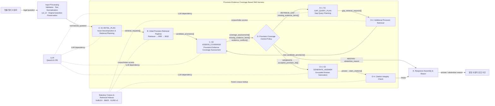

[← 시작 문서로 돌아가기](00_START_HERE.md)

# 3. 최종 시스템 아키텍처

## 3.1 Figure 1


> 피겨 편집 시 아래 Mermaid와 실행 불변식을 source of truth로 사용한다. 현재 PNG의 미세한 텍스트나 Tool ID는 변경할 수 있지만, 실행 경로와 데이터 계약은 바꾸지 않는다.

## 3.2 논리 기준 Mermaid



## 3.3 아키텍처의 세 경로

### 기본 처리

```text
사용자 질의
→ 입력 처리
→ S1 INITIAL_PLAN
→ 최초 조문 검색
→ S2 ASSESS_COVERAGE
→ Provision-Coverage Control Policy
```

### 근거 보완

```text
RETRIEVE_GAP
→ S1 GAP_QUERY_PLAN
→ 추가 조문 검색
→ S2 재판정
→ Control Policy 재실행
```

### 종료

```text
GENERATE
→ S3 GENERATE_ANSWER
→ Citation Integrity Check
→ Response Assembly
→ 사용자
```

```text
ABSTAIN
→ Response Assembly
→ 사용자
```

`ABSTAIN`은 무응답이 아니라 **근거 불충분 보류 응답**이다.

---

# 4. 피겨의 선·색·간선 라벨

## 4.1 실선

| 선 | 의미 | 정확한 경로 |
|---|---|---|
| 검정 실선 | 기본 실행 및 구조화 데이터 전달 | 사용자 → 입력 → S1 → 검색 → S2 → Policy |
| 녹색 실선 | Gap retrieval loop | D → D-1 → D-2 → C → D |
| 파란 실선 | 답변 생성 경로 | D → D-3 → D-4 → E |
| 빨간 실선 | 답변 보류 경로 | D → E |

## 4.2 점선

| 선 | 의미 | 연결 대상 |
|---|---|---|
| 보라 점선 | LLM 사용 관계 | A, C, D-1, D-3 ↔ Qwen |
| 주황 점선 | 코퍼스·인덱스 참조 | B, D-2, D-4 ↔ 법령 자원 |

점선은 실행 순서가 아니므로 피겨에서 화살촉을 생략한다.

## 4.3 선 위에 적는 최종 텍스트

| 연결 | 최종 라벨 |
|---|---|
| 사용자 → 입력 처리 | `legal question` |
| 입력 처리 → S1 | `normalized_question` |
| S1 → 최초 검색 | `retrieval_requests[]` |
| 최초 검색 → S2 | `candidate_provisions[]` |
| S2 → Policy | `coverage_assessments[] · missing_evidence_items[] · evidence_conflicts[]` |
| Policy → Gap Plan | `RETRIEVE_GAP · missing_evidence_items[]` |
| Gap Plan → 추가 검색 | `gap_retrieval_requests[]` |
| 추가 검색 → S2 | `new candidate_provisions[]` |
| Policy → S3 | `GENERATE · accepted_provision_ids[]` |
| S3 → 인용 검사 | `answer · claim_citations[]` |
| 인용 검사 → 응답 구성 | `PASS` |
| Policy → 응답 구성 | `ABSTAIN · abstention_reason` |
| 응답 구성 → 사용자 | `answer / abstention reason` |

`legal_issues[]`와 `required_evidence_items[]`는 S1의 결과지만 검색기로 보내는 값이 아니다. Run State에 저장되어 S2가 사용한다.

---
