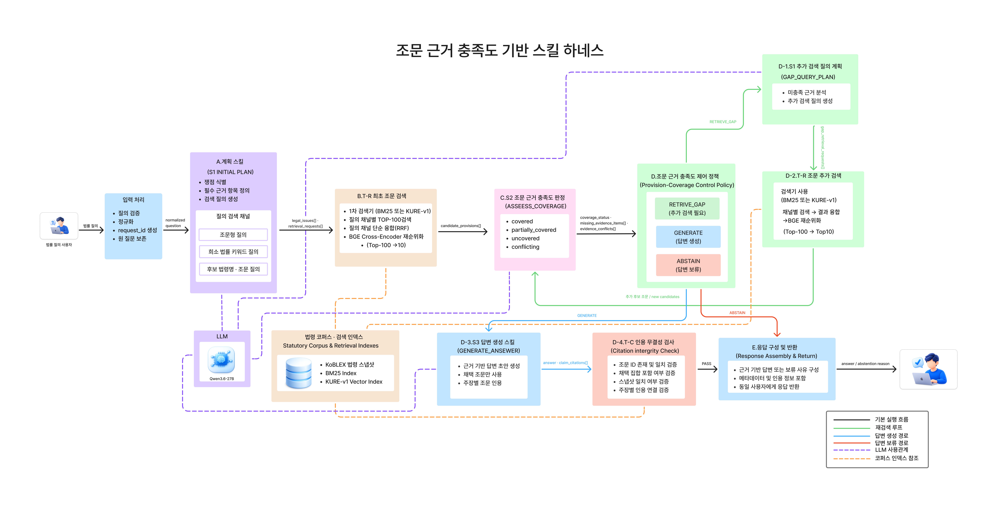
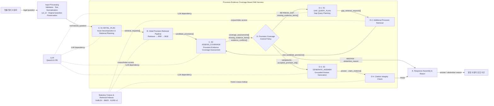

# 조문 근거 충족도 기반 스킬 하네스 — 연구·구현 인수인계 문서

> 이 문서는 다른 연구자·개발자·에이전트가 기존 대화나 노션 문맥 없이도 연구 설계, 시스템 아키텍처, 스킬·도구 계약, 실험, 평가, 재현성 계획을 이어서 수행할 수 있도록 만든 단일 기준 문서다. 아래의 **동결 결정**, **실행 불변식**, **데이터 계약**은 명시적인 변경 기록 없이 임의로 바꾸지 않는다.

## 0. 인수인계 시 가장 먼저 읽을 부분

1. [연구 정체성과 핵심 주장](#1-연구-정체성과-핵심-주장)
2. [동결된 핵심 결정](#2-동결된-핵심-결정)
3. [최종 시스템 아키텍처](#3-최종-시스템-아키텍처)
4. [Run State와 제어 정책](#8-run-state와-제어-정책)
5. [비교 실험과 평가](#13-비교-실험)
6. [즉시 실행할 작업](#22-즉시-실행할-작업)

### 함께 전달되는 자산

- [Figure 1 — 최종 시스템 아키텍처](assets/figure_1_system_architecture.png)
- [아키텍처·분기·설계 근거 PDF](assets/architecture_design_reference.pdf)
- `assets/icon_user_question.png`
- `assets/icon_user_response.png`
- `assets/icon_llm.png`
- `assets/icon_storage.png`

---

# 1. 연구 정체성과 핵심 주장

## 1.1 최종 제목

**국문**

> 한국 법률 다중 홉 질의응답을 위한 조문 근거 충족도 기반 스킬 하네스

**영문**

> A Provision-Evidence Coverage-Based Skill Harness for Korean Multi-Hop Statutory Question Answering

논문 제목에서 `단일 LLM`은 제거한다. 동일 Qwen 체크포인트를 S1·S2·S3가 사용한다는 사실은 방법 및 구현 절에서 설명하되, 제목의 신규성 중심은 **조문 근거 충족도 기반 스킬 하네스**에 둔다.

## 1.2 문제 정의

한국 법률 질문은 하나의 대표 조문만으로 해결되지 않을 수 있다. 정의, 적용 범위, 성립 요건, 예외, 절차, 기한, 관할, 법적 효과, 제재, 위임 규정, 준용·연결 규정이 서로 다른 조문이나 법령에 분산될 수 있다.

일회성 RAG는 일부 관련 조문만 회수하고도 곧바로 답변을 생성할 수 있다. 고정 반복 검색은 현재 근거가 충분한지와 무관하게 일정 횟수만 반복한다. 이 연구는 질문을 법률 쟁점과 필수 근거 항목으로 구조화하고, 검색된 조문을 각 근거 항목에 연결한 뒤, 현재의 근거 충족 상태와 검색 예산으로 다음 행동을 결정한다.

## 1.3 한 문장 핵심 주장

> 동일한 쟁점 계획, 생성 모델, 검색기, 재순위화기와 답변 생성 조건을 유지한 상태에서 법률 쟁점별 조문 근거 충족도 제어를 추가하면, 미충족 조문 회수와 근거가 완비된 답변 산출을 개선하고 불완전한 근거에 대한 성급한 답변을 줄일 수 있다.

실험 전에는 `개선했다`, `우수했다`, `감소시켰다` 같은 결과 과거형을 사용하지 않는다.

## 1.4 핵심 기여

1. 법률 질문을 `legal_issues[]`와 `required_evidence_items[]`로 표현한다.
2. 각 근거 항목을 실제 `provision_id` 및 `support_spans`와 연결한다.
3. 각 근거 항목의 상태를 `covered`, `partially_covered`, `uncovered`, `conflicting`으로 운영적으로 정의한다.
4. 질문별 Run State와 검색 예산을 이용해 `RETRIEVE_GAP`, `GENERATE`, `ABSTAIN`을 선택한다.
5. KoBLEX 전체 문항에 법률 근거 유형, critical 여부, 조문 연결 주석 및 통제된 근거 결손 상태를 구축한다.
6. 동일한 검색·생성 조건에서 즉시 생성, 고정 반복 검색, 범용 충분성 제어와 비교한다.

## 1.5 신규성이 아닌 것

다음은 신규 기여로 주장하지 않는다.

- 질의 분해 자체
- 조문형·키워드형·법령 후보형 질의 생성 자체
- 반복 검색이나 gap query 자체
- BM25, KURE-v1, BGE, Qwen 모델 자체
- RRF 자체
- 인용 ID가 존재하는지만 확인하는 기능 자체

## 1.6 연구 범위 밖

- 멀티에이전트 효과
- MCP 효과
- GraphRAG
- 판례 검색
- 모델 파인튜닝
- 실서비스 법률 상담 효용성
- 자동 판단이 법률가를 대체한다는 주장

---

# 2. 동결된 핵심 결정

| 항목 | 현재 결정 |
|---|---|
| 연구 도메인 | 한국 법령 조문 기반 개방형 다중 홉 QA |
| 벤치마크 | KoBLEX 226문항, 1-hop 55 / 2-hop 125 / 3-hop 46 |
| 생성·판정 LLM | `Qwen/Qwen3.6-27B`, 동일 체크포인트를 S1·S2·S3에서 사용 |
| 스킬 패키지 수 | 3개: S1 계획, S2 충족도 판정, S3 답변 생성 |
| 스킬 호출 지점 | 4개: S1 INITIAL, S1 GAP, S2, S3 |
| 1차 검색 후보 | BM25와 KURE-v1만 비교. Hybrid는 현재 범위에서 제외 |
| 검색기 선택 | 개발 세트에서 사전등록 규칙으로 하나를 선택하고 테스트 전에 동결 |
| 순위 융합 | 선택된 검색기에서 쟁점·질의 채널별 ranked list를 RRF로 융합 |
| 재순위화 | BGE cross-encoder, Top-100 → Top-10 |
| 총 검색 라운드 | 현재 기본값 3회: 최초 1회 + Gap 최대 2회 |
| 무진척 중단 | 연속 2회 동안 새 조문 ID도 없고 critical 상태 개선도 없으면 중단 |
| 중복 질의 | 동일 정규화 질의 재사용 금지 |
| 정상 행동 | `RETRIEVE_GAP`, `GENERATE`, `ABSTAIN` |
| 오류 종료 | `EXECUTION_FAILURE`; `ABSTAIN`과 분리 |
| 장비 | NVIDIA H200 141GB 1장 + CPU/RAM 검색·제어 |
| 하네스 명칭 | 별도 `Harness Controller` 노드를 두지 않음. 하네스는 전체 실행 런타임 |
| UI | 핵심 아키텍처와 연구 범위에서 제외. 사용자 입력·출력만 표현 |

### 과거 설계에서 폐기하거나 변경한 것

- `KoE5 우선 후보` → `KURE-v1 dense 후보`로 변경
- `BM25 / KURE / Hybrid` 세 후보 → `BM25 / KURE-v1` 두 후보로 축소
- 제목의 `단일 LLM` → 제거
- `Harness Controller`, `Action Router` → 피겨 및 기여 설명에서 제거
- `R0 / R1 / R2` → 표준 용어인 Sparse/Dense 및 검색기 실명으로 교체
- `RAG`를 데이터 저장소 이름으로 사용 → 금지. 저장소는 `Statutory Corpus & Retrieval Indexes`
- BGE를 데이터 자원 박스에 포함 → 금지. BGE는 Retrieval Pipeline 내부 reranker

---

# 3. 최종 시스템 아키텍처

## 3.1 Figure 1



> 피겨 편집 시 아래 Mermaid와 실행 불변식을 source of truth로 사용한다. 현재 PNG의 미세한 텍스트나 Tool ID는 변경할 수 있지만, 실행 경로와 데이터 계약은 바꾸지 않는다.

## 3.2 논리 기준 Mermaid



## 3.3 아키텍처의 세 경로

### 기본 처리

```text
사용자 질의
→ 입력 처리
→ S1 INITIAL_PLAN
→ 최초 조문 검색
→ S2 ASSESS_COVERAGE
→ Provision-Coverage Control Policy
```

### 근거 보완

```text
RETRIEVE_GAP
→ S1 GAP_QUERY_PLAN
→ 추가 조문 검색
→ S2 재판정
→ Control Policy 재실행
```

### 종료

```text
GENERATE
→ S3 GENERATE_ANSWER
→ Citation Integrity Check
→ Response Assembly
→ 사용자
```

```text
ABSTAIN
→ Response Assembly
→ 사용자
```

`ABSTAIN`은 무응답이 아니라 **근거 불충분 보류 응답**이다.

---

# 4. 피겨의 선·색·간선 라벨

## 4.1 실선

| 선 | 의미 | 정확한 경로 |
|---|---|---|
| 검정 실선 | 기본 실행 및 구조화 데이터 전달 | 사용자 → 입력 → S1 → 검색 → S2 → Policy |
| 녹색 실선 | Gap retrieval loop | D → D-1 → D-2 → C → D |
| 파란 실선 | 답변 생성 경로 | D → D-3 → D-4 → E |
| 빨간 실선 | 답변 보류 경로 | D → E |

## 4.2 점선

| 선 | 의미 | 연결 대상 |
|---|---|---|
| 보라 점선 | LLM 사용 관계 | A, C, D-1, D-3 ↔ Qwen |
| 주황 점선 | 코퍼스·인덱스 참조 | B, D-2, D-4 ↔ 법령 자원 |

점선은 실행 순서가 아니므로 피겨에서 화살촉을 생략한다.

## 4.3 선 위에 적는 최종 텍스트

| 연결 | 최종 라벨 |
|---|---|
| 사용자 → 입력 처리 | `legal question` |
| 입력 처리 → S1 | `normalized_question` |
| S1 → 최초 검색 | `retrieval_requests[]` |
| 최초 검색 → S2 | `candidate_provisions[]` |
| S2 → Policy | `coverage_assessments[] · missing_evidence_items[] · evidence_conflicts[]` |
| Policy → Gap Plan | `RETRIEVE_GAP · missing_evidence_items[]` |
| Gap Plan → 추가 검색 | `gap_retrieval_requests[]` |
| 추가 검색 → S2 | `new candidate_provisions[]` |
| Policy → S3 | `GENERATE · accepted_provision_ids[]` |
| S3 → 인용 검사 | `answer · claim_citations[]` |
| 인용 검사 → 응답 구성 | `PASS` |
| Policy → 응답 구성 | `ABSTAIN · abstention_reason` |
| 응답 구성 → 사용자 | `answer / abstention reason` |

`legal_issues[]`와 `required_evidence_items[]`는 S1의 결과지만 검색기로 보내는 값이 아니다. Run State에 저장되어 S2가 사용한다.

---

# 5. 표기법과 변수명

## 5.1 표기법

| 표기 | 뜻 |
|---|---|
| `[]` | 배열/List. 여러 객체 또는 값이 들어갈 수 있음 |
| `{}` | 객체/Object. 여러 필드를 가진 구조 |
| `_id` | 단일 식별자 |
| `_ids[]` | 식별자 배열 |
| `snake_case` | JSON 및 코드 필드 이름 |
| `UPPER_CASE` | 제어 행동 또는 enum 값 |
| `candidate_*` | 검색됐지만 아직 답변 근거로 채택되지 않은 후보 |
| `accepted_*` | 판정 후 답변에 사용할 수 있도록 승인된 것 |
| `critical` | 없으면 핵심 법률 결론을 충분히 정당화할 수 없는 근거 항목 |

## 5.2 최종 데이터 이름

```text
normalized_question
run_id

legal_issues[]
required_evidence_items[]
retrieval_requests[]

candidate_provisions[]

evidence_links[]
coverage_assessments[]
missing_evidence_items[]
evidence_conflicts[]

accepted_provision_ids[]
gap_retrieval_requests[]

claims[]
claim_citations[]
answer
abstention_reason
```

## 5.3 `normalized_question`

결정적 text normalization만 수행한다.

허용:

- 앞뒤 공백 제거
- 연속 공백 및 줄바꿈 통일
- Unicode normalization
- 형식적 조문 번호 표기 통일
- 원 질문 별도 보존

금지:

- 질문 요약
- 법률 용어 의미 치환
- 법적 쟁점 추론
- 검색 목적의 의미 재작성

의미 처리는 S1부터 시작한다.

---

# 6. 블록별 책임

## 6.1 입력 처리

**입력**: 사용자 원질의 또는 KoBLEX 문항  
**출력**: `normalized_question`, `run_id`

역할:

- 형식 검증
- 문자 및 공백 정규화
- 실행 ID 생성
- 원 질문 보존

이 단계에서는 LLM을 사용하지 않고 법률적 판단을 하지 않는다.

## 6.2 S1 `INITIAL_PLAN`

**패키지**: `legal_issue_and_query_planning`  
**Entry point**: `INITIAL_PLAN`

입력:

- `normalized_question`
- `query_history[]`

출력:

- `legal_issues[]`
- `required_evidence_items[]`
- `retrieval_requests[]`

역할:

- 질문을 해결하는 데 필요한 최소 법률 쟁점 식별
- 쟁점별 필수 법적 근거 의무 정의
- 쟁점별 다채널 검색 요청 생성

제약:

- 모든 질문을 억지로 복수 쟁점으로 분해하지 않는다.
- `legal_issues[]` 최소 크기는 1이다.
- 원 질문은 Run State에 보존한다.

### 세 검색 질의 채널

1. **Provision-style Query**: 조문 문체에 가까운 검색 질의
2. **Sparse Keyword Query**: 법률 명사, 요건, 행위 중심 키워드 질의
3. **Statute-aware Query**: 후보 법령명과 법률 쟁점을 포함한 질의

후보 법령명은 힌트로 사용하며 전체 검색 범위를 강제 제한하지 않는다.

## 6.3 최초 조문 검색 파이프라인

**구현 Tool ID 선택 사항**: `T-R` / `retrieve_provisions`  
**논문 피겨 권장 이름**: `Initial Provision Retrieval Pipeline`

입력:

- `retrieval_requests[]`

출력:

- `candidate_provisions[]`

처리:

```text
BM25 또는 KURE-v1
→ 질의 채널별 Top-100
→ 질의 채널 단위 RRF
→ 조문 ID 중복 제거
→ BGE Cross-Encoder Reranking
→ Top-10
```

검색기는 관련 후보를 찾는 역할만 하며, 근거 충분성을 판단하지 않는다.

## 6.4 S2 `ASSESS_COVERAGE`

**패키지**: `provision_coverage_assessment`

입력:

- `legal_issues[]`
- `required_evidence_items[]`
- `candidate_provisions[]`
- 현재 Run State

출력:

- `evidence_links[]`
- `coverage_assessments[]`
- `missing_evidence_items[]`
- `evidence_conflicts[]`

역할:

- 쟁점–근거 항목–조문 ID 연결
- 실제 지지 구간 `support_spans` 기록
- 각 필수 근거의 충족 상태 판정

### 상태 enum

| 상태 | 의미 |
|---|---|
| `covered` | 필요한 근거가 실제 조문과 연결되고 충분히 확보됨 |
| `partially_covered` | 관련 근거는 있으나 요구되는 근거 의무를 완전히 만족하지 못함 |
| `uncovered` | 해당 근거를 지지할 조문을 확보하지 못함 |
| `conflicting` | 적용 범위·예외·시점 등에서 해소되지 않은 충돌이 있음 |

S2는 다음 행동을 선택하지 않는다. 구조화된 판정만 반환한다.

## 6.5 Provision-Coverage Control Policy

입력:

- `coverage_assessments[]`
- `missing_evidence_items[]`
- `evidence_conflicts[]`
- 남은 검색 예산
- 질의 이력
- 무진척 상태

출력 action:

- `RETRIEVE_GAP`
- `GENERATE`
- `ABSTAIN`

S2와 Policy를 분리하는 이유는 판정 모델의 효과와 제어 정책의 효과를 인과적으로 분리하기 위함이다.

## 6.6 S1 `GAP_QUERY_PLAN`

**동일 패키지의 두 번째 Entry point**: `GAP_QUERY_PLAN`

입력:

- critical인 `missing_evidence_items[]`
- `evidence_conflicts[]`
- 기존 accepted evidence 요약
- `query_history[]`
- `seen_provision_ids[]`

출력:

- `gap_retrieval_requests[]`

원 질문을 반복하지 않고 현재 부족한 근거를 직접 겨냥하는 비중복 검색 요청을 만든다.

## 6.7 추가 조문 검색

**논문 피겨 권장 이름**: `Additional Provision Retrieval`

입력:

- `gap_retrieval_requests[]`

출력:

- 새로운 `candidate_provisions[]`

최초 검색과 동일하게 동결된 검색기, RRF, BGE 설정을 사용한다. 새 후보 조문은 반드시 S2에 누적 입력되어 재판정을 거친다.

## 6.8 S3 `GENERATE_ANSWER`

**패키지**: `grounded_legal_answer_generation`

입력:

- 원 질문
- `legal_issues[]`
- accepted evidence links
- accepted provision texts

출력:

- `claims[]`
- `claim_citations[]`
- `answer`

검색 후보 전체를 전달하지 않는다. S2에서 채택된 조문만 사용한다.

## 6.9 Citation Integrity Check

**구현 Tool ID 선택 사항**: `T-C` / `validate_citation_integrity`

검사:

1. 인용한 조문 ID가 동결 코퍼스에 존재하는가
2. 인용 ID가 `accepted_provision_ids[]`에 포함되는가
3. 인용 본문이 동결 스냅샷과 일치하는가
4. 인용이 필요한 각 주장에 최소 하나의 조문 ID가 연결되는가

출력:

- `PASS`
- 또는 `FAIL` + `validation_errors[]`

이 도구는 법적 타당성, entailment, 결론의 정당성을 판정하지 않는다.

## 6.10 Response Assembly & Return

입력:

- 검증된 답변
- 또는 구조화된 abstention 정보

출력:

- 최종 답변
- 또는 근거 불충분 보류 응답

사용자에게 내부 action enum이 아니라 이해 가능한 메시지를 반환한다.

## 6.11 LLM

- 모델: `Qwen3.6-27B`
- S1 INITIAL, S1 GAP, S2, S3가 동일 체크포인트를 사용
- 검색, Policy, Citation Integrity, Response Assembly는 Qwen을 직접 사용하지 않음

## 6.12 법령 코퍼스·검색 인덱스

구성:

- KoBLEX 법령 스냅샷
- BM25 Index
- KURE-v1 Vector Index

사용:

- 최초 검색
- 추가 검색
- Citation Integrity의 원문/ID 검증

BGE는 저장 자원이 아니라 검색 파이프라인 내부 reranker이다.

---

# 7. 대표 데이터 계약

## 7.1 `retrieval_request`

```json
{
  "request_id": "RQ-I1-01",
  "issue_id": "I1",
  "evidence_item_id": "E1",
  "query_channel": "provision_style",
  "query_text": "...",
  "top_k": 100
}
```

`query_channel` 후보:

```text
provision_style
sparse_keyword
statute_aware
```

## 7.2 `candidate_provision`

```json
{
  "provision_id": "STATUTE_ARTICLE_ID",
  "statute_name": "법령명",
  "provision_text": "조문 본문",
  "issue_id": "I1",
  "source_request_id": "RQ-I1-01",
  "retrieval_round": 1,
  "first_stage_score": 0.0,
  "fusion_rank": 1,
  "rerank_score": 0.0
}
```

## 7.3 `required_evidence_item`

```json
{
  "evidence_item_id": "E1",
  "issue_id": "I1",
  "evidence_type": "application_requirement",
  "description": "성립·적용 요건에 관한 근거",
  "critical": true
}
```

## 7.4 `evidence_link`

```json
{
  "issue_id": "I1",
  "evidence_item_id": "E1",
  "provision_id": "STATUTE_ARTICLE_ID",
  "support_spans": [
    {
      "start_char": 10,
      "end_char": 68
    }
  ],
  "assessment": "accepted"
}
```

## 7.5 `coverage_assessment`

```json
{
  "evidence_item_id": "E1",
  "status": "covered",
  "linked_provision_ids": ["STATUTE_ARTICLE_ID"],
  "rationale": "해당 조문이 필수 요건을 명시함"
}
```

## 7.6 `claim_citation`

```json
{
  "claim_id": "C1",
  "provision_ids": ["STATUTE_ARTICLE_ID"]
}
```

---

# 8. Run State와 제어 정책

## 8.1 최종 Run State

```text
RunState = {
  question,
  normalized_question,
  run_id,
  phase,

  legal_issues[],
  required_evidence_items[],

  provision_assessments[],
  accepted_provision_ids[],
  missing_critical_items[],
  evidence_conflicts[],

  query_history[],
  seen_provision_ids[],

  remaining_round_budget,
  remaining_request_budget,
  no_progress_rounds,

  last_validated_event,
  action_trace[]
}
```

`accepted_provision_ids[]`는 독립 원본 상태가 아니다. `provision_assessments[]` 또는 accepted `evidence_links[]`에서 파생한 조문 ID의 합집합이다.

## 8.2 Critical blocker

```text
critical_blockers = critical evidence items whose status is in
{partially_covered, uncovered, conflicting}
```

non-critical 근거가 부족한 것만으로는 반드시 생성을 막지 않는다.

## 8.3 최종 Policy

```text
IF critical_blockers is empty
   AND unresolved critical conflicts are empty:
    GENERATE

ELSE IF retrieval budget remains
        AND a non-duplicate gap retrieval request can be produced
        AND no_progress_rounds < 2:
    RETRIEVE_GAP

ELSE:
    ABSTAIN
```

## 8.4 진척 판정

```text
progress =
  new_unique_provision_ids > 0
  OR any critical status improves:
     uncovered → partially_covered
     uncovered → covered
     partially_covered → covered
     conflicting → partially_covered
     conflicting → covered
```

## 8.5 검색 예산

현재 기본값:

```text
총 retrieval rounds = 3
Round 1 = initial retrieval
Round 2 = first gap retrieval
Round 3 = final gap retrieval
```

- 정답 hop 수를 실행 입력이나 종료 조건으로 사용하지 않는다.
- 동일 normalized query 재사용 금지
- 연속 2회 무진척이면 조기 중단

---

# 9. ABSTAIN 설계

## 9.1 정의

```text
ABSTAIN ≠ 무응답
ABSTAIN ≠ 시스템 오류
```

`ABSTAIN`은 시스템이 정상 작동했지만 필수 근거를 검색 예산 내에 충분히 확보하지 못한 정상 종료다.

## 9.2 실행 경로

```text
Policy
→ ABSTAIN
→ Response Assembly
→ 사용자에게 근거 부족 보류 응답
```

S3와 Citation Integrity를 호출하지 않는다.

## 9.3 구조화 출력

```json
{
  "status": "ABSTAIN",
  "abstention_reason": "INSUFFICIENT_CRITICAL_EVIDENCE",
  "missing_critical_evidence_items": [
    {
      "evidence_item_id": "E3",
      "issue_id": "I1",
      "evidence_type": "exception_or_exclusion",
      "description": "적용 예외 또는 배제 규정"
    }
  ],
  "unresolved_conflicts": [],
  "termination_reason": "RETRIEVAL_BUDGET_EXHAUSTED",
  "retrieval_rounds_used": 3,
  "user_message": "현재 확보된 조문만으로는 필수 근거가 충분하지 않아 답변을 보류합니다."
}
```

## 9.4 Reason codes

**법률 근거 상태**

```text
INSUFFICIENT_CRITICAL_EVIDENCE
UNRESOLVED_EVIDENCE_CONFLICT
```

**검색 종료 사유**

```text
RETRIEVAL_BUDGET_EXHAUSTED
NO_RETRIEVAL_PROGRESS
NO_VALID_GAP_QUERY
MAX_RETRIEVAL_ROUNDS_REACHED
```

## 9.5 사용자 메시지 예시

> 현재 확보된 조문만으로는 질문의 핵심 법률 쟁점을 충분히 판단할 수 없어 법률 결론을 생성하지 않았습니다. 미충족 필수 근거는 예외·단서 규정과 적용 기한에 관한 규정입니다. 추가 검색 예산이 소진되어 답변을 보류합니다.

## 9.6 `EXECUTION_FAILURE`와 구분

| 상태 | 의미 |
|---|---|
| `ABSTAIN` | 정상 작동했으나 근거 부족 |
| `EXECUTION_FAILURE` | Schema 오류, 도구 실패, 잘못된 참조 등 실행 실패 |

---

# 10. 검색 파이프라인

## 10.1 검색기 후보

| 조건 | 1차 검색기 | 질의 채널 통합 | 2차 재순위화 |
|---|---|---|---|
| Sparse | BM25 | 쟁점별 RRF | BGE cross-encoder |
| Dense | KURE-v1 exact vector search | 쟁점별 RRF | BGE cross-encoder |

Hybrid는 현재 주 실험 범위에서 제외한다.

## 10.2 선택 규칙

개발 세트에서 다음 우선순위로 하나를 선택한다.

1. Complete Evidence Recall@100
2. Provision Recall@100
3. Complete Evidence Recall@10
4. Provision Recall@10
5. 동률이면 지연시간과 구현 단순성

선택한 검색기와 revision, 전처리, top-k, RRF 설정을 테스트 전에 동결한다.

## 10.3 RRF의 역할

RRF는 BM25와 KURE-v1을 합치는 hybrid 용도가 아니다. 선택된 한 검색기에서 여러 법률 쟁점·질의 채널별 ranked list를 융합한다.

```text
각 issue의 provision-style 결과
각 issue의 sparse-keyword 결과
각 issue의 statute-aware 결과
→ Issue-level Reciprocal Rank Fusion
```

## 10.4 검색 데이터 처리

- 법령명 + 조·항·호 계층 + 본문을 검색 표현으로 사용
- 긴 조문은 조·항·호 경계를 우선해 분할
- 필요 시 중첩 window 사용
- chunk 점수를 원본 provision ID로 통합
- split/trim 비율과 원본 ID 매핑 보존
- Dense 검색은 정확도 우선 exact inner-product search
- KURE-v1 문서 임베딩은 오프라인 구축

---

# 11. 스킬 패키지 구현 계약

## 11.1 공통 패키지 구조

```text
skills/
├── legal_issue_and_query_planning/
│   ├── SKILL.md
│   ├── prompt_template.jinja
│   ├── input.schema.json
│   ├── output.schema.json
│   └── failure_contract.json
├── provision_coverage_assessment/
│   ├── SKILL.md
│   ├── prompt_template.jinja
│   ├── input.schema.json
│   ├── output.schema.json
│   └── failure_contract.json
└── grounded_legal_answer_generation/
    ├── SKILL.md
    ├── prompt_template.jinja
    ├── input.schema.json
    ├── output.schema.json
    └── failure_contract.json
```

## 11.2 실패 코드 예시

| 스킬 | 실패 코드 예시 |
|---|---|
| S1 | `INVALID_PLAN`, `EMPTY_ISSUE_SET`, `DUPLICATE_RETRIEVAL_REQUEST` |
| S2 | `INVALID_COVERAGE`, `UNMAPPED_EVIDENCE`, `UNKNOWN_PROVISION_REFERENCE` |
| S3 | `UNSUPPORTED_CLAIM`, `INVALID_CITATION`, `EMPTY_ANSWER` |

스킬은 다음 스킬이나 도구를 직접 호출하지 않는다.

---

# 12. 실행 불변식

1. S1·S2·S3는 서로를 직접 호출하지 않는다.
2. 스킬은 다음 행동을 선택하지 않는다.
3. S2는 검색기를 직접 호출하지 않는다.
4. S3는 Citation Integrity 도구를 직접 호출하지 않는다.
5. 모든 결과는 Schema/참조 검증과 상태 갱신을 거친 뒤 Policy에서 사용한다.
6. 추가 검색 결과는 반드시 S2 재판정을 거친다.
7. `ABSTAIN`은 S3와 Citation Integrity를 우회한다.
8. Citation Integrity `PASS` 전에는 생성 답변을 최종 반환하지 않는다.
9. Qwen은 A·C·D-1·D-3에만 연결한다.
10. 코퍼스·인덱스는 B·D-2·D-4에만 연결한다.
11. 최초 검색과 추가 검색은 동일한 동결 검색 설정을 사용한다.
12. S3에는 accepted evidence만 전달한다.
13. `ABSTAIN`과 `EXECUTION_FAILURE`를 로그·평가에서 분리한다.

---

# 13. 비교 실험

## 13.1 연구 질문

### RQ1. 전체 시스템 효과

동일한 S1, Qwen, 동결 검색기, BGE, S3 조건에서 제안 하네스가 즉시 생성보다 2·3-hop 최종 채택 조문 F1과 근거가 완비된 답변 산출을 개선하는가?

### RQ2. 법률 근거 유형의 가치

법률 근거 유형 기반 S2가 범용 missing-information 충분성 제어보다 부족한 critical 근거의 오승인을 줄이는가?

### RQ3. 운영 비용

고정 반복 검색 대비 검색 라운드, Qwen 호출, 토큰, 지연시간, Supported Answer Yield당 비용은 어떻게 달라지는가?

## 13.2 비교군

| 조건 | 구성 | 목적 |
|---|---|---|
| C0 No Retrieval | 검색 없는 Qwen 답변 | 파라메트릭 하한선 |
| C1 Fixed-K One-Shot RAG | 원 질문 고정 Top-k 검색 후 1회 생성 | 일반 RAG |
| C2 ParSeR-Qwen | Retrieve–Rerank–Selection 통제 재구현 | KoBLEX 원 방법 계열 |
| C-DaR DaR-Qwen | 분해·질의 정제·쟁점별 Selection에 가까운 재구현 | 외부 강한 방법 비교 |
| C3 Controlled Immediate | M과 같은 S1·초기 검색·S3, S2 없이 즉시 생성 | RQ1 핵심 인과 기준선 |
| C4 Fixed Iterative | 충족도 없이 최대 라운드까지 검색 후 생성 | 고정 반복 검색 |
| C5 Generic Sufficiency | 같은 항목·상태·예산, 법률 근거 유형 규칙만 제거 | RQ2 핵심 기준선 |
| M Proposed | 법률 근거 유형 기반 S2 + 조건부 재검색·생성·보류 | 제안 방법 |

## 13.3 공정 비교를 위한 고정 요소

- Qwen model/revision/tokenizer/chat template
- 질문×seed별 캐시된 S1 INITIAL_PLAN 결과
- 개발 세트에서 선택·동결한 검색기
- RRF 및 BGE Top-10
- 동결 법령 코퍼스와 전처리
- 최대 검색 예산
- S3 prompt/sampling
- Citation Integrity 검사

## 13.4 제거 실험

1. `w/o Gap Query`: 원 질문 반복
2. `w/o Abstention`: 예산 소진에도 생성
3. `w/o Reranker`: BGE 제거
4. `w/o Harness State`: 라운드별 독립 실행
5. `M-ForcedMax`: S2와 Gap Query를 유지하지만 최대 라운드까지 항상 검색

C3은 `w/o Provision Coverage`, C5는 `w/o Legal Evidence Types` 역할을 겸한다.

## 13.5 진단 실험

- Gold Evidence → S3: 생성기 상한
- Gold Coverage Decision + System Retrieval: Policy/coverage 상한
- System Coverage + Gold Candidate Pool: 검색 실패와 S2 실패 분리

---

# 14. 데이터와 주석

## 14.1 KoBLEX

- 226문항
- 1-hop 55
- 2-hop 125
- 3-hop 46
- 배경 시나리오, 질문, 정답, 지지 조문 포함

## 14.2 근거 항목 주석 Schema

```text
question_id
issue_id
issue_description
evidence_item_id
evidence_type
critical
criticality_rationale
gold_support_groups
satisfaction_rule
scope_or_temporal_condition
annotation_rationale
```

## 14.3 근거 유형

- 주된 적용 규정·권리·의무
- 정의·적용 범위
- 성립·적용 요건
- 예외·단서·배제
- 절차·기한·관할
- 법적 효과·제재·벌칙
- 위임 규정·하위 법령
- 준용·인용·연결 규정

`critical=true`는 해당 항목을 제거하면 핵심 결론이 바뀌거나 조문으로 완전하게 정당화할 수 없게 되는 경우다.

## 14.4 복수 근거 만족 규칙

대체 가능한 조문과 결합이 필요한 조문을 표현하기 위해 `gold_support_groups`를 사용한다.

```text
gold_satisfied(item, S) = 1
iff there exists G in gold_support_groups(item)
such that G ⊆ S
```

## 14.5 주석 절차

- 법학 배경 평가자 2명 우선
- 독립 주석 후 협의
- 원 주석과 합의 주석 모두 보존
- evidence type, criticality, issue–provision mapping 합의도 보고
- 시스템 출력 및 조건을 주석자에게 비공개

## 14.6 스트레스 세트

문항별로 다음 상태를 구축한다.

1. 모든 critical gold 조문 포함
2. 각 critical item 제거
3. 제거 item을 hard negative 조문으로 교체
4. gold + distractor 혼합
5. 전문가가 확인한 conflict 사례

신뢰할 만한 conflict 사례를 구축하지 못하면 `conflicting`은 탐색적 분석으로 하향한다.

---

# 15. 평가 지표

## 15.1 조문 수준

질문 `q`의 gold 조문 집합을 `G_q`, 최종 accepted 조문 집합을 `A_q`로 정의한다.

```text
Precision_q = |A_q ∩ G_q| / |A_q|
Recall_q    = |A_q ∩ G_q| / |G_q|
F1_q        = harmonic_mean(Precision_q, Recall_q)

CompleteEvidence@K_q = 1 if G_q ⊆ RetrievedTopK_q else 0
```

`A_q`가 비어 있으면 Precision과 F1을 0으로 정의한다.

주 지표 후보:

- 2·3-hop Provision F1
- Complete Evidence Recall@100
- Provision Recall@100

## 15.2 S2 intrinsic 평가

통제된 gold item과 후보 조문 상태에서 M과 C5를 비교한다.

```text
FCR_micro = Σ false_covered / Σ truly_uncovered
FCR_macro = mean_q(false_covered_q / truly_uncovered_q)
```

- False-Covered Rate
- False-Uncovered Rate
- Covered Precision
- S2 Macro-F1
- issue–provision mapping F1
- Gap Recovery Rate

스트레스 상태가 같은 원 질문에서 파생되므로 bootstrap unit은 상태가 아니라 `question_id`다.

## 15.3 답변 수준

- Answer Coverage
- Supported Answer Yield
- Unsafe Answer Rate
- Unsupported Claim Rate
- Token-F1
- LF-Eval 또는 명시적으로 구분한 adapted evaluator
- Citation Precision/Recall/F1
- 존재하지 않는 조문 ID 인용률
- accepted evidence 외 조문 인용률

Token-F1과 evaluator 점수는 두 방식으로 보고한다.

1. ABSTAIN을 0점 처리한 end-to-end 결과
2. 실제 답변한 문항만 계산한 answered-only 결과

## 15.4 비용

- 검색 라운드 수
- retrieval request 수
- Qwen 호출 수
- input/output/total tokens
- BM25, KURE, BGE, Qwen, end-to-end latency
- H200 peak memory
- Supported Answer Yield당 비용

---

# 16. 통계 계획

- 질문 단위 paired/cluster bootstrap 10,000회
- F1, LF-Eval, FCR 차이의 95% CI
- 이진 오류는 사전 이진화 규칙을 둔 McNemar 보조 분석
- 다중 비교 Holm 보정
- 2·3-hop 결합 분석을 confirmatory
- hop별·법령군별 분석은 subgroup/exploratory
- p-value뿐 아니라 effect size와 CI 보고
- 조건별 3개 고정 seed
- 문항별 seed 평균 후 문항 단위 분석
- seed를 독립 표본으로 취급하지 않음

---

# 17. 사람 평가

- 최종 테스트 최소 60문항
- hop별 층화
- 법학 배경 평가자 2명 우선
- 시스템명과 hop 정보 블라인드
- 무작위 순서

평가 항목:

- 결론 정확성
- 조문 적절성
- 누락 근거
- 과도한 단정
- 보류 적정성
- 주장–조문 실제 지지 여부

Cohen’s kappa 또는 Krippendorff’s alpha를 보고한다.

---

# 18. 실행 환경

- NVIDIA H200 141GB 1장
- Qwen3.6-27B BF16 text-only serving
- vLLM structured output
- 문서 임베딩은 오프라인 1회 구축
- 온라인에서 KURE 질의 인코딩만 수행
- Qwen, KURE, BGE는 질의 단위 순차 스케줄링 우선
- 하네스, BM25, exact vector search, Citation Integrity는 CPU/RAM 병행
- 실제 토큰 분포를 측정해 32K/64K/131K 중 가장 작은 충분 컨텍스트를 동결
- S1·S2는 non-thinking structured output
- S3는 thinking 기반 grounded generation
- format-only retry 1회
- 재시도 후 Schema 유효율 목표 99% 이상

모델 revision과 라이브러리 버전은 실행 직전에 확인하고 lock file에 기록한다.

---

# 19. 로그와 재현성

## 19.1 로그 Schema

```text
run_id, condition, seed, question_id,
model_id, model_revision, tokenizer_revision,
skill_id, skill_version, prompt_hash,
tool_id, tool_revision, tool_arguments,
retrieval_request, query_channel, retriever_id,
top100_ids, fused_ids, bge_top10_ids, bge_scores,
legal_issues, required_evidence_items,
provision_assessments,
accepted_provision_ids,
missing_evidence_items, evidence_conflicts,
coverage_output, policy_action,
input_tokens, output_tokens, latency_ms,
final_answer, cited_provision_ids,
abstention_reason, termination_reason,
execution_error
```

## 19.2 보존 아티팩트

- S1·S2·S3 SKILL.md
- prompt templates
- JSON Schemas
- failure contracts
- Run State transition and Policy code
- corpus hash and preprocessing code
- BM25/KURE/BGE/Qwen revision
- raw and adjudicated annotations
- raw run logs
- aggregation/statistics/figure scripts
- H200/CUDA/vLLM/Transformers lock file

---

# 20. 권장 코드 구조

```text
project/
├── README.md
├── configs/
│   ├── model.yaml
│   ├── retrieval.yaml
│   ├── policy.yaml
│   └── experiment_conditions.yaml
├── harness/
│   ├── runner.py
│   ├── run_state.py
│   ├── policy.py
│   ├── validation.py
│   ├── state_update.py
│   └── tracing.py
├── skills/
│   ├── legal_issue_and_query_planning/
│   ├── provision_coverage_assessment/
│   └── grounded_legal_answer_generation/
├── tools/
│   ├── retrieve_provisions/
│   └── validate_citation_integrity/
├── retrieval/
│   ├── bm25.py
│   ├── kure.py
│   ├── rrf.py
│   ├── reranker.py
│   └── corpus.py
├── annotation/
│   ├── guidelines.md
│   ├── schema.json
│   └── adjudication.py
├── evaluation/
│   ├── provision_metrics.py
│   ├── coverage_metrics.py
│   ├── answer_metrics.py
│   ├── bootstrap.py
│   └── human_eval.py
├── experiments/
│   ├── baselines/
│   ├── ablations/
│   └── run_experiment.py
├── tests/
│   ├── test_initial_path.py
│   ├── test_gap_path.py
│   ├── test_generate_path.py
│   ├── test_abstain_path.py
│   ├── test_citation_integrity.py
│   └── test_state_invariants.py
└── artifacts/
```

---

# 21. 12주 로드맵

| 주 | 작업 | 완료 기준 |
|---:|---|---|
| 1 | KoBLEX/법령 코퍼스 확보, hash, 예비 주석 | 226문항·코퍼스 통계 검증, 예비 20~30문항 |
| 2 | BM25/KURE/BGE, chunk 규칙 | Recall 및 Complete Evidence Recall 로그 |
| 3 | Qwen/vLLM/Schema 사전점검, 기준선 착수 | memory/context/JSON 성공 |
| 4 | S1 INITIAL/GAP 및 cache | 입출력 계약 통과 |
| 5 | S2 intrinsic 평가와 stress states | FCR 산출 가능 |
| 6 | Policy/S3/Citation Integrity | 세 action 및 종료 경로 unit test |
| 7 | C0/C1/C3/C5/M smoke test | end-to-end 로그 완결 |
| 8 | ParSeR/DaR/C4/M-ForcedMax | 공정 비교 검증 |
| 9 | 검색기/prompt/budget/statistics 동결 | 최종 설정 hash |
| 10 | 최종 테스트 및 핵심 ablation | 누락 없는 raw results |
| 11 | cluster bootstrap 및 사람 평가 | CI/effect size/agreement |
| 12 | KCI 원고·도표·재현 패키지 | 본문/부록/checklist |

---

# 22. 즉시 실행할 작업

## P0 — 먼저 해야 함

- [ ] 최종 변수명으로 Notion/PDF/Figma/코드 문서 통일
- [ ] S1 input/output JSON Schema 작성
- [ ] S2 input/output JSON Schema 작성
- [ ] S3 input/output JSON Schema 작성
- [ ] RunState dataclass 또는 Pydantic model 작성
- [ ] Policy unit test 작성
- [ ] BM25와 KURE-v1 smoke retrieval 구현
- [ ] BGE reranker 연결
- [ ] 20~30문항 예비 주석

## P1 — 실험 전

- [ ] 개발/테스트 group-stratified split 동결
- [ ] BM25 vs KURE-v1 선택
- [ ] 검색 round=3 및 no-progress=2 확인
- [ ] C3/C5/M end-to-end 실행
- [ ] abstention response schema 구현
- [ ] raw log completeness test

## P2 — 최종 실험

- [ ] 외부 baselines
- [ ] 모든 ablations
- [ ] final test 3 seeds
- [ ] bootstrap and human evaluation
- [ ] reproducibility package

---

# 23. 선행연구와 신규성 경계

## KoBLEX / ParSeR

- 주 벤치마크 및 지지 조문 제공
- Retrieve–Rerank–Selection 계열
- ParSeR Selection을 하네스로 재명명하지 않는다.

## Decompose-and-Refine

- atomic sub-question / legal issue decomposition
- provision-style, sparse keyword, statute-aware query refinement
- S1은 고정 선행 구성으로 사용하고 신규성으로 주장하지 않는다.

## S2G-RAG

- evidence sufficiency와 structured gap 기반 반복 retrieval
- 반복 gap retrieval 자체를 최초로 주장하지 않는다.
- 차이는 typed legal evidence obligation, provision ID linkage, criticality, budget-aware skill/tool control이다.

## 관련 분야

- Adaptive-RAG: 질문 복잡도 기반 검색 적응
- citation generation 연구: claim-level citation과 groundedness 평가

---

# 24. 사용하지 않을 주장

- 본 시스템은 멀티에이전트다.
- MCP가 정확도를 향상한다.
- 질의 분해를 최초로 제안한다.
- gap retrieval을 최초로 제안한다.
- KURE-v1 또는 BM25가 모든 한국 법률 검색기보다 우수하다.
- 조문 ID 존재가 법적 타당성을 보장한다.
- Citation Integrity가 entailment를 보장한다.
- 자동 Coverage Assessment가 법률가의 최종 판단을 대체한다.
- KoBLEX 결과가 실제 법률 상담 능력을 증명한다.

---

# 25. 타당성 위협과 대응

| 위협 | 위험 | 대응 |
|---|---|---|
| DaR 중복 | S1을 신규성으로 오해 | S1 고정, controlled baseline 포함 |
| S2G-RAG 중복 | sufficiency/gap 최초 주장 | 최초 주장 금지, C5 비교 |
| 검색기 효과 혼입 | retriever 성능이 harness 효과로 보임 | 개발 세트에서 선택 후 C3/C5/M에 고정 |
| 같은 Qwen의 자기평가 | 계획·판정·생성 결합 | intrinsic S2, stress set, deterministic citation check, human eval |
| 충족도 라벨 부재 | gold provision을 critical/type로 오인 | 별도 2인 주석 |
| 충돌 과장 | hard negative를 conflict로 오인 | 전문가 curated conflict 없으면 exploratory |
| 테스트 누출 | 정답 조문/hop로 policy tuning | dev/test 분리와 설정 hash |
| 과도한 abstention | 안전 지표만 좋아짐 | Answer Coverage, Supported Answer Yield, end-to-end 0점 처리 |
| H200 OOM | 여러 모델 및 긴 context | 순차 스케줄링, 최소 충분 context 동결 |

---

# 26. 지도교수 미팅용 요약

## 60초 설명

> 이 연구는 한국 법률 다중 홉 질문을 법률 쟁점과 필수 조문 근거 항목으로 먼저 구조화한다. 검색된 조문을 각 근거 항목과 연결해 현재 근거가 충분한지 판정하고, critical 근거가 부족하면 그 gap만 다시 검색한다. 모든 필수 근거가 확보되면 채택 조문만으로 답변을 생성하고 인용 무결성을 검사한다. 검색 예산 내에 근거를 확보하지 못하면 불완전한 법률 결론 대신 부족 근거와 종료 이유를 포함한 보류 응답을 반환한다. 기여는 질문별 근거 상태와 예산을 이용해 S1·S2·S3와 검색·검사 도구의 실행 순서를 관리하는 데 있다.

## 예상 질문

### DaR와 S2G-RAG를 결합한 것 아닌가?

쟁점 분해와 범용 sufficiency/gap은 선행 구성이다. 신규성은 법률 쟁점별 typed evidence obligation, 실제 provision ID linkage, criticality와 budget 기반 control, 그리고 이를 평가하기 위한 annotation/stress protocol에 둔다.

### 하네스가 정확히 무엇인가?

모델이 아니라 질문별 상태, 실행 순서, 검색 예산, 재시도, 중단, 답변 보류를 관리하는 실행 런타임이다.

### 같은 Qwen이 계획·판정·답변을 하면 자기평가 아닌가?

그래서 intrinsic S2 평가, controlled stress states, deterministic citation integrity, independent human evaluation을 분리한다.

### 모두 보류하면 안전 지표가 좋아지는 것 아닌가?

Answer Coverage와 Supported Answer Yield를 함께 보고하고, 보류를 0점 처리한 end-to-end 답변 지표를 병기한다.

---

# 27. 현재 남은 미결정 사항

다음은 구현 전 또는 지도교수 확인 후 결정한다.

1. 226문항 전체 2인 주석의 현실성
2. `준용·인용·연결 규정`을 독립 evidence type으로 유지할지
3. DaR 재구현을 주 비교군으로 둘지 보조 비교로 둘지
4. 답변 수준 주 안전성 지표를 Supported Answer Yield와 Unsafe Answer Rate 중 무엇으로 둘지
5. conflict set을 주 결과에 포함할 수 있는지
6. 외부 judge를 사용할지 사람 평가 중심으로 제한할지
7. 최종 검색기 BM25 또는 KURE-v1

---

# 28. 피겨 최종 체크리스트

- [ ] 제목: `조문 근거 충족도 기반 스킬 하네스`
- [ ] S1 → Retrieval 선은 `retrieval_requests[]`
- [ ] Retrieval → S2 선은 `candidate_provisions[]`
- [ ] S2 → Policy는 최종 변수명 사용
- [ ] Policy → S3에 `accepted_provision_ids[]`
- [ ] D-2 → S2 재판정 선 존재
- [ ] ABSTAIN → Response Assembly 직결
- [ ] Citation PASS 전 최종 답변 반환 없음
- [ ] LLM 점선은 A/C/D-1/D-3에만 연결
- [ ] 데이터 점선은 B/D-2/D-4에만 연결
- [ ] BGE는 Retrieval 내부
- [ ] RRF는 질의 채널 단위 순위 융합
- [ ] 점선에 화살촉 없음
- [ ] `ABSTAIN`과 `EXECUTION_FAILURE` 혼동 없음

---

# 29. 참고문헌 및 링크

- Lee, J. et al. (2025). [KoBLEX: Open Legal Question Answering with Multi-hop Reasoning](https://aclanthology.org/2025.emnlp-main.200/)
- Lee, J., Kim, H., & Lee, G. (2026). [Decompose-and-Refine: Structured Legal Question Answering with Parametric Retrieval](https://arxiv.org/abs/2605.24454)
- Li, M. et al. (2026). [S2G-RAG: Structured Sufficiency and Gap Judging for Iterative Retrieval-Augmented QA](https://aclanthology.org/2026.acl-long.1185/)
- Jeong, S. et al. (2024). [Adaptive-RAG](https://aclanthology.org/2024.naacl-long.389/)
- Gao, T. et al. (2023). [Enabling Large Language Models to Generate Text with Citations](https://aclanthology.org/2023.emnlp-main.398/)
- [Qwen3.6-27B model card](https://huggingface.co/Qwen/Qwen3.6-27B)
- [KURE-v1 model card](https://huggingface.co/nlpai-lab/KURE-v1)
- [bge-reranker-v2-m3-ko model card](https://huggingface.co/dragonkue/bge-reranker-v2-m3-ko)

> 구현 시작 전에 모델·라이브러리 revision과 serving 옵션을 다시 확인하고 lock file에 기록한다.

---

# 30. 인수인계 완료 조건

다음 사람이 작업을 시작하기 전에 아래를 확인한다.

- 이 문서와 Figure 1의 경로가 일치하는가
- Notion/논문/Figma/코드 변수명이 일치하는가
- 동결 결정과 미결정 사항이 구분돼 있는가
- 실험 결과를 보기 전에 검색기, budget, prompt, metrics를 lock할 계획이 있는가
- 모든 비교군이 같은 S1/검색/S3/예산 조건을 공유하는가
- ABSTAIN과 실행 오류를 별도로 기록하는가

이 문서를 변경할 때는 문서 상단의 `version`, `status`, `last_updated`와 변경 기록을 함께 갱신한다.
